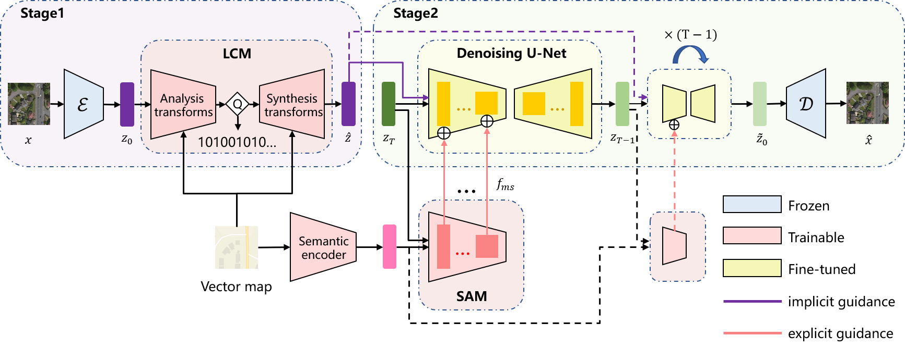
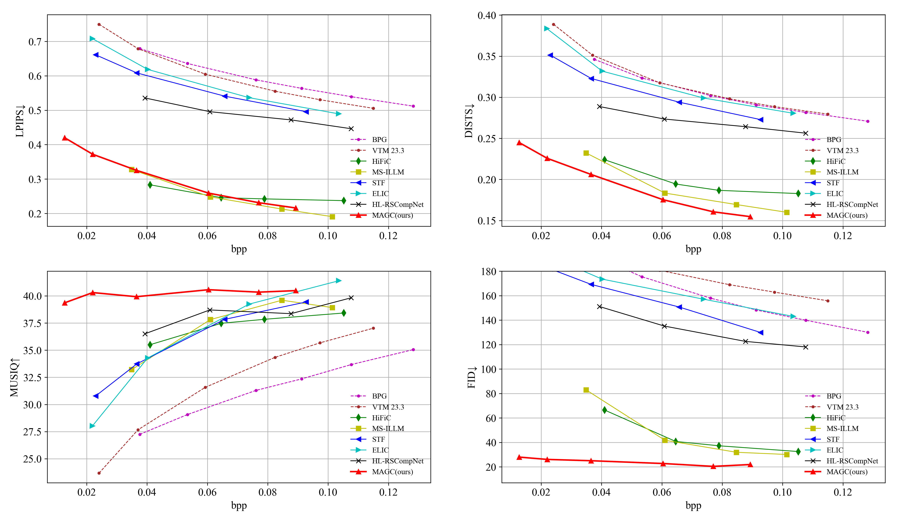

## MAGC: Map-Assisted Remote-Sensing Image Compression at Extremely Low Bitrates

Official code for [Paper](https://arxiv.org/abs/2409.01935) 

<p align="center">
    
</p>


## :book:Table Of Contents

- [Compression Performance](#performance)
- [Installation](#installation)
- [Pretrained Models](#pretrained_models)
- [Dataset](#dataset)
- [Inference](#inference)
- [Train](#train)

## <a name="performance"></a>:eyes:Quantitative and Qualitative Compression Performance
### Quantitative Comparisons
<p align="center">
    
</p>

### Qualitative Comparisons
<p align="center">
    
</p>

## <a name="installation"></a>:gear:Installation


```shell
# clone this repo
git clone https://github.com/WHUyyx/MAGC.git

# create an environment with python >= 3.9
conda create -n MAGC python=3.9
conda activate MAGC
pip install -r requirements.txt
```

## <a name="pretrained_models"></a>:dna:Pretrained Models
Please download the pretrained model from [Google Drive](https://arxiv.org/abs/2409.01935) and place it in the magc_ckpts/ckpts_stage2/ folder for inference.

## <a name="dataset"></a>:climbing:Dataset
Please access the training set and test set from [SGDM](https://github.com/wwangcece/SGDM).


## <a name="inference"></a>:crossed_swords:Inference
```shell
CUDA_VISIBLE_DEVICES=0 python inference.py \
--ckpt magc_ckpts/ckpts_stage2/v40_step=120999-lpips=0.3132.ckpt \
--config configs/model/cldm.yaml \
--input_path ../dataset/Synthetic-v18-45k/test_4500 \
--steps 50 \
--batchsize 30 \
--output_root metrics_4500_magc \
--device cuda    
```

## <a name="train"></a>:stars:Train
TBD


## Citation
Please cite us if our work is useful for your research.

```
@misc{ye2024map,
      title={Map-Assisted Remote-Sensing Image Compression at Extremely Low Bitrates}, 
      author={Yixuan Ye and Ce Wang and Wanjie Sun and Zhenzhong Chen},
      year={2024},
      eprint={2409.01935},
      archivePrefix={arXiv},
      primaryClass={cs.CV}
}
```

## Acknowledgement

This project is based on [DiffBIR](https://github.com/XPixelGroup/DiffBIR) and [CompressAI](https://github.com/InterDigitalInc/CompressAI). Thanks for their awesome work.

## Contact

If you have any questions, please feel free to contact with me at yeyixuan@whu.edu.cn.
